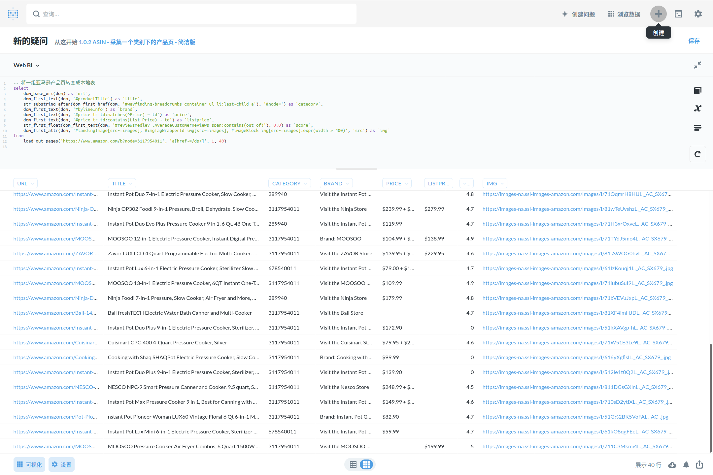

Pulsar README
===================

Pulsar is an open source solution to scrape web data at scale.

Extracting web data at scale is extremely hard. Websites change frequently and are becoming more complex, meaning web data collected is often inaccurate or incomplete, pulsar is an open source solution to fix such issues.

Pulsar supports the Network As A Database paradigm, so we can turn the Web into tables and charts using simple SQLs.

We also have a plan to develop an advanced AI to extract every field in webpages with notable accuracy.



# Features
- Web spider: browser rendering, ajax data crawling, scheduling, distributed, highly optimized
- X-SQL: extend SQL to manage web data: Web crawling, scraping, Web content mining, Web BI
- Bot stealth: never get banned
- Simple API: one line of code to scrape, or one SQL to turn a website into a table
- RPA: imitating human behavior for stealth, SPA crawling, or do something awesome
- Data quantity assurance: smart retry, accurate scheduling
- Big data: designed for large scale crawling, various backend storage support: HBase/MongoDB/Gora

For more information check [platon.ai](http://platon.ai)

# Use pulsar as a library

Maven:

```
<dependency>
  <groupId>ai.platon.pulsar</groupId>
  <artifactId>pulsar-all</artifactId>
  <version>1.8.2-SNAPSHOT</version>
</dependency>
```

Create a pulsar session:
```kotlin
val url = "https://list.jd.com/list.html?cat=652,12345,12349"
val session: PulsarSession = PulsarContexts.createSession()
```
Load a page, fetch it from the internet if it's not in the local storage, or if it's expired, and then parse it into a Jsoup document
```kotlin
val page = session.load(url, "-expires 1d")
val document = session.parse(page)
```
or
```kotlin
val document = session.loadDocument(url, "-expires 1d")
```
Load a page, fetch it from the internet if it's not in the local storage, or if it's expired, and then load out pages specified by -outLink, or they are expired
```kotlin
session.loadOutPages(url, "-expires 1d -itemExpires 7d -outLink a[href~=item]")
```
Load a page, fetch it from the internet if it's not in the local storage, or if it's expired, and then scrape the fields in the page, all fields are restricted in a page section specified by restrictCss, each field is specified by a css selector
```kotlin
session.scrape(url, "-expires 1d", "li[data-sku]", listOf(".p-name em", ".p-price"))
```
or
```kotlin
session.scrape(url, "-i 1d", "li[data-sku]", mapOf("name" to ".p-name em", "price" to ".p-price"))
```
Scrape fields from the out pages:
```kotlin
session.scrapeOutPages(url, "-expires 1d -itemExpires 7d -outLink a[href~=item]", ".product-intro", listOf(".sku-name", ".p-price"))
```
or
```kotlin
session.scrapeOutPages(url, "-i 1d -ii 7d -ol a[href~=item]", ".product-intro", mapOf("name" to ".sku-name", "price" to ".p-price"))
```

## X-SQL

Scrape a single page:

```sql
select
    dom_first_text(dom, '#productTitle') as `title`,
    dom_first_text(dom, '#price tr td:contains(List Price) ~ td') as `listprice`,
    dom_first_text(dom, '#price tr td:matches(^Price) ~ td, #price_inside_buybox') as `price`,
    array_join_to_string(dom_all_texts(dom, '#wayfinding-breadcrumbs_container ul li a'), '|') as `categories`,
    dom_base_uri(dom) as `baseUri`
from
    load_and_select('https://www.amazon.com/dp/B00BTX5926', ':root')
```

Execute the X-SQL:

```kotlin
val context: SQLContext = SQLContexts.activate()
context.executeQuery(sql)
```

The result set is as follows:

    TITLE                                                            | LISTPRICE | PRICE  | CATEGORIES                                    | BASEURI
    Tara Toys Ariel Necklace Activity Set - Amazon Exclusive (51394) | $19.99    | $12.99 | Toys & Games|Arts & Crafts|Craft Kits|Jewelry | https://www.amazon.com/dp/B00BTX5926

# Use pulsar as a server

## Requirements

- Memory 4G+
- Maven 3.2+
- The latest version of the Java 11 OpenJDK
- java and jar on the PATH
- Google Chrome 90+

## Build from source

    git clone https://github.com/platonai/pulsar.git
    cd pulsar && bin/build.sh

## Start the pulsar server if not started

```shell
bin/pulsar
```

## Scrape a webpage in another terminal window

```shell
bin/scrape.sh
```

The response is as follows:

```json
{
    "uuid": "cc611841-1f2b-4b6b-bcdd-ce822d97a2ad",
    "statusCode": 200,
    "pageStatusCode": 200,
    "pageContentBytes": 1607636,
    "resultSet": [
        {
            "title": "Tara Toys Ariel Necklace Activity Set - Amazon Exclusive (51394)",
            "listprice": "$19.99",
            "price": "$12.99",
            "categories": "Toys & Games|Arts & Crafts|Craft Kits|Jewelry",
            "baseuri": "https://www.amazon.com/dp/B00BTX5926"
        }
    ],
    "pageStatus": "OK",
    "status": "OK"
}
```

Here are X-SQLs for [The Complete Amazon Data Model](pulsar-app/pulsar-sites-support/pulsar-site-amazon/src/main/resources/config/sites/amazon/crawl/parse/sql).
